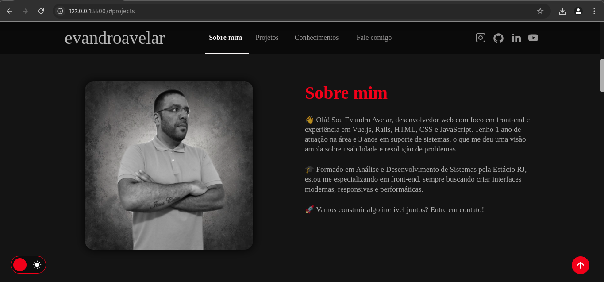

# 🎨 Portfólio - Evandro Avelar 💻

  

  <a href="">🔗 Confira o projeto aqui</a>

---

## 🖥️ Sobre o Projeto

Este projeto foi desenvolvido com o objetivo de apresentar meu trabalho como **Desenvolvedor Web**. Aqui, você poderá conhecer minha trajetória, habilidades e alguns dos projetos que desenvolvi ao longo do tempo.

---

## 📌 Estrutura do Site

O site é composto pelas seguintes seções:

🔹 **Home** - Uma breve apresentação;
🔹 **Sobre Mim** - Minha trajetória e meu estado atual na carreira;
🔹 **Projetos** - Alguns dos projetos que desenvolvi e participei;
🔹 **Conhecimentos** - Tecnologias que domino;
🔹 **Fale Comigo** - Área com meus contatos;
🔹 **Redes Sociais** - Links para me encontrar nas redes.

---

## 🚀 Tecnologias Utilizadas

O site **ainda está em desenvolvimento**, mas até o momento utilizei as seguintes tecnologias:

  
  
  

---

## 📞 Contato

Caso queira entrar em contato comigo, basta acessar minhas redes sociais ou enviar uma mensagem diretamente pelo site! ✉️

<table>
  <tr>
    <td>
      
    </td>
    <td>
      <strong>Feito por <a href="https://github.com/oevandroavelar">Evandro Avelar</a> 🚀</strong>
    </td>
  </tr>
</table>

📌 *Este projeto está em constante evolução. Fique ligado para futuras atualizações!*

